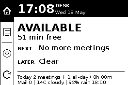

# Info Screen Desk

Personal desk assistant for a Raspberry Pi Zero and Waveshare 2.7inch e-Paper HAT V2.



It shows:

- Home: availability, next meeting, and today summary
- Agenda: next meetings
- Focus: local focus timer
- Tomorrow: first meeting, meeting count, and booked time
- Mail/weather signal: unread count, high-priority unread count, current weather, and commute-hour rain chance
- Diagnostics: Wi-Fi, IP, auth mode, display driver

The on-screen navigation rail is on the left side to match the physical HAT buttons.

## Buttons

- `KEY1` / BCM `5`: Home
- `KEY1` hold: Diagnostics
- `KEY2` / BCM `6`: Agenda
- `KEY2` hold: Tomorrow
- `KEY3` / BCM `13`: start/stop focus timer
- `KEY3` hold: cycle focus preset
- `KEY4` / BCM `19`: Refresh calendar
- `KEY4` hold: clear the panel, then full refresh

## Microsoft Auth

Recommended:

```bash
DESK_AUTH_MODE=device_code
```

Create an app registration in Microsoft Entra, enable public client/device-code flow, and add delegated Microsoft Graph permissions:

- `User.Read`
- `Calendars.Read`
- `Mail.Read` if email signal is enabled

Then run once on the Pi:

```bash
cd ~/info_screen_desk
set -a
. /etc/info-screen-desk.env
set +a
python3 src/info_screen.py --login
```

If Microsoft returns `AADSTS7000218` during device login, the app registration is configured as a confidential client. Use `DESK_AUTH_MODE=client_credentials` with a client secret, or enable public client flows in the Entra app registration.

Alternative app-only mode:

```bash
DESK_AUTH_MODE=client_credentials
DESK_TENANT_ID=...
DESK_CLIENT_ID=...
DESK_CLIENT_SECRET=...
DESK_CALENDAR_EMAIL=you@example.com
```

This requires Microsoft Graph application permission `Calendars.Read` and admin consent.
Add application permission `Mail.Read` as well if `DESK_EMAIL_ENABLED=1`.

## Optional Signals

Email signal is enabled by default and only displays counts:

```bash
DESK_EMAIL_ENABLED=1
DESK_EMAIL_REFRESH_MINUTES=10
```

Weather uses Open-Meteo and needs only coordinates:

```bash
DESK_WEATHER_ENABLED=1
DESK_WEATHER_LATITUDE=52.3676
DESK_WEATHER_LONGITUDE=4.9041
DESK_WEATHER_LABEL=Amsterdam
DESK_COMMUTE_WEATHER_HOUR=18
```

The app repaints sparingly: full calendar refreshes happen on the configured cadence, while timer redraws only occur for active focus, active meetings, meeting-start warnings, and meeting boundaries.

## Local Preview

```bash
python3 -m venv .venv
.venv/bin/python -m pip install -r requirements.txt
.venv/bin/python src/info_screen.py --sample --preview docs/screenshots/home.png --view home
.venv/bin/python src/info_screen.py --sample --preview docs/screenshots/agenda.png --view agenda
.venv/bin/python src/info_screen.py --sample --preview docs/screenshots/focus.png --view focus
.venv/bin/python src/info_screen.py --sample --preview docs/screenshots/tomorrow.png --view tomorrow
```

The live Pi render is saved to `docs/screenshots/pi-current-render.png` for documentation.

## Pi Install

Clone this project to:

```bash
~/info_screen_desk
```

Then:

```bash
cd ~/info_screen_desk
chmod +x run_info_screen.sh scripts/install.sh scripts/health-check.sh
./scripts/install.sh
sudo editor /etc/info-screen-desk.env
```

Test the panel:

```bash
python3 src/test_display.py
```

Start:

```bash
sudo systemctl enable --now info-screen-desk-buttons.service
journalctl -u info-screen-desk-buttons.service -n 100 --no-pager
```

Health check:

```bash
~/info_screen_desk/scripts/health-check.sh
```
